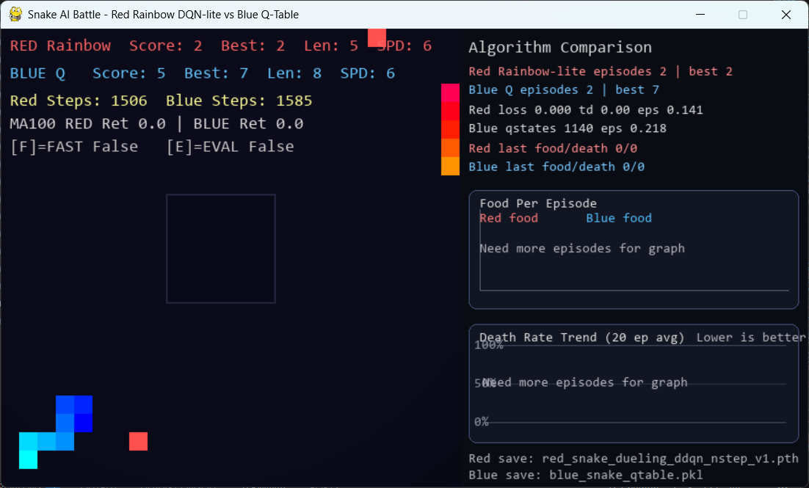
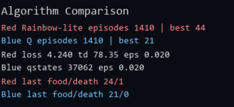
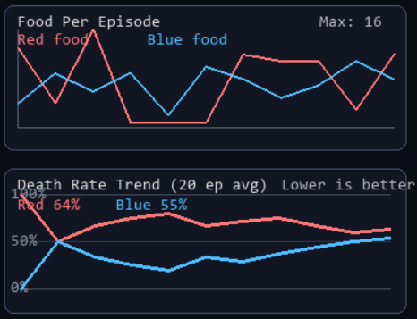

# 🐍 AI vs AI Snake Battle

### A Comparative Reinforcement Learning Framework for Competitive Multi-Agent Learning


## 📸 Demo

<p align="center">
  
</p>

---

## Overview

This project is a research-oriented reinforcement learning environment designed to compare two fundamentally different learning algorithms in a competitive multi-agent setting.

Two autonomous Snake agents continuously compete against each other while learning from their own experiences.

Unlike traditional reinforcement learning environments where agents compete against scripted opponents, both agents in this project are learning simultaneously, creating an evolving competitive environment.

The objective is to investigate how Deep Reinforcement Learning compares with Classical Reinforcement Learning when both algorithms must continuously adapt against another intelligent opponent.

---

## Project Goals

- Compare Deep Reinforcement Learning and Tabular Reinforcement Learning.
- Study competitive multi-agent learning.
- Investigate reward shaping techniques.
- Analyze long-term learning behavior.
- Evaluate algorithm stability and convergence.
- Provide a reproducible research environment.

---

# Algorithms

## 🔴 Red Agent — Rainbow DQN-lite

The Red Agent is implemented using an enhanced Deep Q-Network.

Implemented improvements include:

- Dueling Network Architecture
- Double DQN
- Prioritized Experience Replay
- N-Step Returns
- Target Network
- Gradient Clipping
- Experience Replay Buffer
- Epsilon-Greedy Exploration

Unlike a standard DQN, these improvements significantly improve training stability and learning efficiency.

---

## 🔵 Blue Agent — Tabular Q-Learning

The Blue Agent uses traditional Q-Learning.

Features include:

- Q-Table Learning
- Bellman Equation Updates
- Online Learning
- Epsilon-Greedy Exploration
- Dynamic State Representation

This provides a strong baseline for comparing classical reinforcement learning against deep reinforcement learning.

---

# Environment

The environment is a modified competitive Snake game.

Features include:

- Two autonomous agents
- Multiple food objects
- Safe spawn region
- Variable movement speeds
- Dynamic food spawning
- Competitive food races
- Real-time learning
- Continuous training

---

# State Representation

The Red Agent receives a continuous feature vector including:

- Food direction
- Food distance
- Tail direction
- Opponent direction
- Snake length
- Length advantage
- Danger detection
- Local free space
- Distance to board center
- Current movement direction
- Current speed
- Opponent speed

The Blue Agent uses a compact discrete state representation suitable for tabular learning.

---

# Reward Engineering

The reward function was carefully designed to encourage intelligent behavior.

Positive rewards include:

- Moving toward food
- Collecting food
- Winning contested food races
- Maintaining open movement space
- Strategic speed selection
- Increasing snake length

Negative rewards include:

- Death
- Wall collisions
- Self collisions
- Opponent collisions
- Stalling
- Backtracking
- Unsafe movement
- Losing food to the opponent

The reward system is designed to encourage long-term survival instead of short-term greedy behavior.

---

# Visualization

The simulator includes a real-time visualization interface displaying:

- Live AI vs AI gameplay
- Current scores
- Best score
- Snake lengths
- Agent Movement speed
- Training statistics
- Learning progress
- Food collection graphs
- Death rate graphs
- Replay statistics
- Loss values
- TD Error
- Exploration rate

## Game UI



## Comparison UI



## Graph UI



---

# Training Features

- Online reinforcement learning
- Automatic checkpoint saving
- Automatic checkpoint loading
- CSV training logs
- Performance tracking
- Replay memory
- Continuous self-play
- Evaluation mode
- Fast training mode

---

# Evaluation Mode

Evaluation mode disables learning and exploration.

During evaluation:

- No model updates
- No replay buffer updates
- No exploration
- Greedy policy execution

This allows direct comparison of learned policies.

---

# Directory Structure

```
RL-AI-vs-AI-Battle/
│
├── models_red_dqn/
│   ├── red_snake_dueling_ddqn_nstep_v1.pth
│   └── red_training_log_dueling_ddqn_nstep_v1.csv
│
├── models_blue_qtable/
│   ├── blue_snake_qtable.pkl
│   └── blue_training_log.csv
│
├── screenshots/
│
├── main.py
├── requirements.txt
└── README.md
```

---

# Installation

Clone the repository

```bash
git clone https://github.com/ArhabJahin/RL-AI-vs-AI-Battle.git
```

Move into the project

```bash
cd RL-AI-vs-AI-Battle
```

Install dependencies

```bash
pip install -r requirements.txt
```

---

# Running

Start training

```bash
python main.py
```

---

# Controls

| Key          | Function               |
| ------------ | ---------------------- |
| **F**        | Toggle Fast Training   |
| **E**        | Toggle Evaluation Mode |
| Close Window | Save Models and Exit   |

---

# Technologies

- Python
- PyTorch
- NumPy
- Pygame
- Deep Reinforcement Learning
- Rainbow DQN-lite
- Tabular Q-Learning
- Pickle
- CSV

---

# Current Research Focus

This project investigates:

- Competitive Reinforcement Learning
- Deep Q-Learning
- Multi-Agent Learning
- Reward Engineering
- Self-Play Training
- Deep RL vs Classical RL
- Adaptive AI Behavior

---

# Planned Improvements

- Full Rainbow DQN implementation
- PPO Agent
- SAC Agent
- DQN vs PPO comparison
- Multi-agent tournaments
- TensorBoard integration
- Custom map generation
- Obstacles
- Curriculum Learning
- Human vs AI mode
- Distributed training

---

# Results

> Training experiments and quantitative evaluation results will be included after sufficient training and analysis.

Future versions of this repository will include:

- Learning curves
- Reward convergence
- Win-rate statistics
- Food collection comparison
- Death rate comparison
- Ablation studies

---

# Citation

This repository accompanies ongoing research.

Citation information will be added after publication.

---

# License

This repository is currently released **without an open-source license** while the associated research is under development.

All rights are reserved by the author until an official publication and licensing decision is made.

---

# Author

**Arhab Jahin Bhuiyan**

Department of Computer Science

Research Interests

- Reinforcement Learning
- Artificial Intelligence
- Machine Learning
- Deep Learning
- Multi-Agent Systems
- Computer Vision

_email: arhabjahin.b@gmail.com_

---

## ⭐ If you find this project interesting, consider starring the repository.
